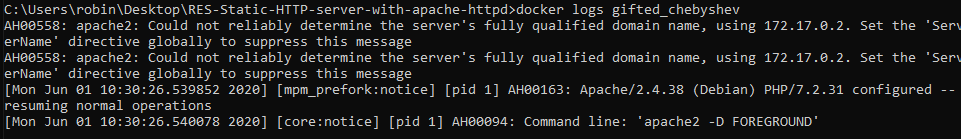
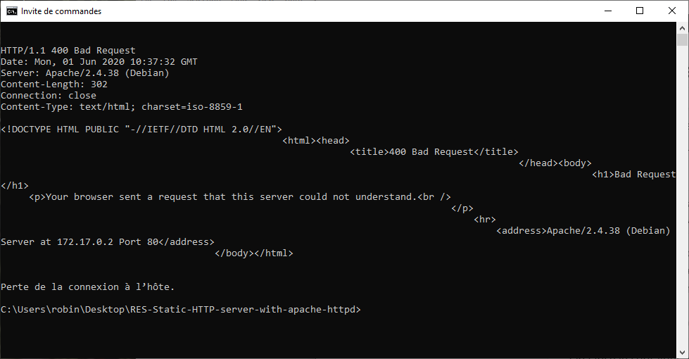
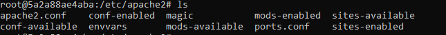
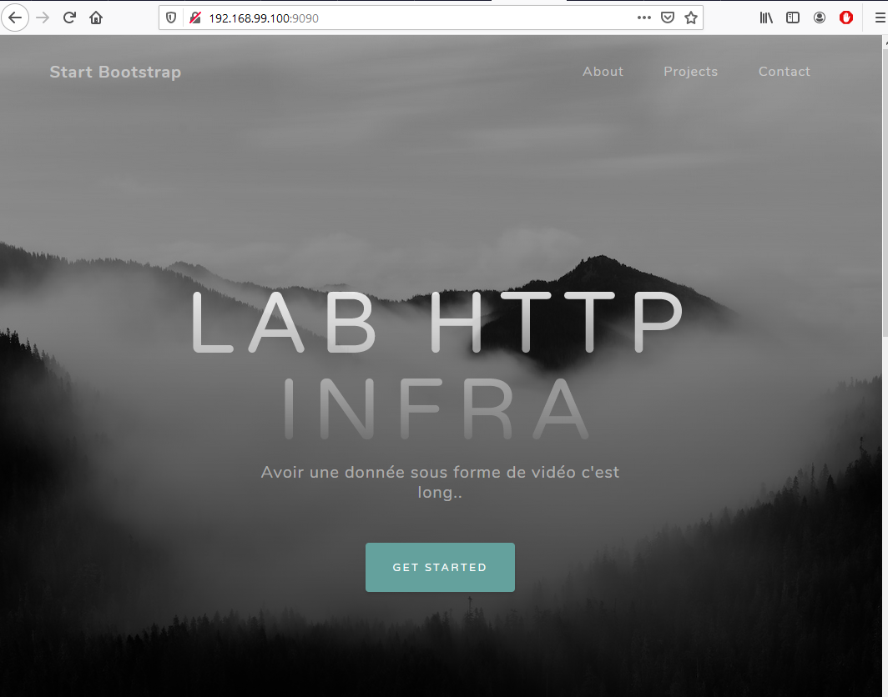
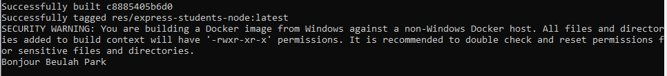

# RES - HTTP Infra - Step 1 - Apache Static

## Image Docker

Comme image Docker on va utiliser l'image php officiel, car elle est plus agréable à utiliser et elle est déjà configurée pour le php. On la trouve sur https://hub.docker.com/_/php/

Dans la documentation sur le repo de l'image sur Docker Hub on trouve que mettre dans notre `Dockerfile` 

```dockerfile
FROM php:7.2-apache
COPY content/ /var/www/html/
```

## Exploration de l’image

On lance le container avec `docker run -d -p 9090:80 php:7.2-apache` 
`-d` pour récupérer la console, `-p` pour faire du port mapping.

Pour vérifier que le container s’est bien lancé on peut regarder `docker logs <container_name>`  et ainsi

on obtient par exemple : 



On peut aussi vérifier que on y à bien accès avec `telnet 192.168.1.100 9090` ce qui nous renvoie cela :



(erreur 403) Ce qui est normal car il y’a rien encore dans notre serveur apache.

Pour explorer l’image on a besoin d’y accéder en mode interactif (obtenir un shell dedans par exemple), 

on peut utiliser la commande `docker exec -it <container_name> /bin/bash` pour obtenir un bash dedans et regarder la configuration qui se trouve dans `/etc/apache2` 



## Ajout de contenu à l’image

* Ajout d’un fichier `index.html` dans le dossier `content/` 

* Build de l’image avec `docker build -t res/apache-php .` (le `.` signifie le dossier courant)

* Lancement de l’image avec `docker run -p 9090:80 -d res/apache-php` (note: pour lancer d’autres images en même temps on doit mettre un port différent)

Maintenant on peut aller voir notre index sur le navigateur ou par telnet.

## Ajout d’un Template

* Téléchargement d’une Template  https://startbootstrap.com/themes/grayscale/ dans le dossier `content`
* re build de l’image et on la lance 

Note: J’ai personnalisé le contenu en modifiant les fichiers sources…..

Et tadaa……..




# RES HTTP Infra - Step 2 - Dynamic

## Node 

Selon le site `https://nodejs.org/en/` la dernière version stable est `12.17.0 `

On crée donc le Dockerfile suivant 

```dockerfile
FROM node:12.17.0
COPY src/ /opt/app
CMD ["node", "/opt/app/index.js"] 
```

Comme dans le docker file d'avant on va copier le contenu que l'on veut avoir dans l'image docker.

La différence étant que l'on utilise node, donc on doit lancer node grâce à ``` CMD ["node", "/opt/app/index.js"]``` 
Ainsi on indique au container de exécuter cette commande pour qu'au démarrage il lance node sur le fichier `index.js`

On crée ensuite un dossier `src` avec `mkdir src`  pour y placer nos fichier sources qui vont être utilisé par `node.js` sur le container.

On crée ensuite dans le dossier `src` l'application `node.js` grâce à `npm init` qui nous permettra de gérer les package etc... (c'est comme ça qu'on fait lol).

Ceci va créer un `package.json` qui contient les informations et encore aucune dépendance. 
On va utiliser le package chance, on l'installe avec `npm install --save chance` (`save`pour enregistrer la dépendance.)

Si on revient dans le `package.json` on voit qu'il a ajouté l'entrée chance et la version.

L'entrée du programme est `index.js` on va donc l'éditer.

```js
var Chance = require('chance') // pour charger la lib en gros 
var chance = new Chance();
console.log("Bonjour " + chance.name());
```

On va ensuite build l’image et lancer le container 

`docker build -t res/express_students_node .` 

et la lancer avec `docker run res/express_students_node`

Note : On doit préciser la commande dans le Dockerfile ou bien au lancé du container car lorsqu’un container docker à finis son exécution il quitte. Donc dès que node à fini d’exécuter `index.js`  cela quitte.

Et voila un exemple d’execution on obtient bien le “Bonjour …..”.



## Express

On doit installer `express`dans le dossier `src/` 

* `npm install --save express`

Modification de `index.js` en 

```javascript
var Chance = require('chance');
var chance = new Chance();

var express = require('express');
var app = express();

app.get('/', function(req, res) {
        res.send(generateAnimals());
});


app.listen(3000, function () {
        console.log("Accepting HTTP requests on port 3000");
});

function generateAnimals() {
        var numberOfAnimals = chance.integer({min: 1, max: 10});
        console.log("Generating " + numberOfAnimals + " animals )...");

        var animals = [];

        for(var i = 0; i < numberOfAnimals; ++i) {
                animals.push({
                        name: chance.animal(),
                        country: chance.country({full: true}),
                        age: chance.age({type: 'teen'}),
                        gender: chance.gender(),
                });
        }

        console.log(animals);
        return animals;
}
```

* Build du container avec `docker build -t res/express-students-node .`

* Lancement du container avec le port mapping avec la commande `docker run -p 3000:3000 -d res/express-students-node` 

